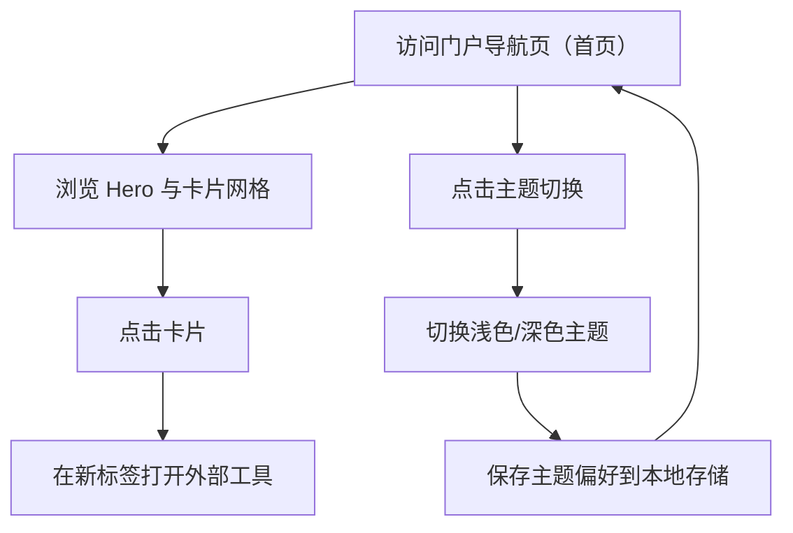

## 1. Product Overview
“Life & Tools Hub”是一个用于快速跳转你常用生活与效率工具的极简门户导航页。
主打高级感视觉（极简、留白、卡片网格）、轻量交互（主题切换、Hero动效），支持静态部署到 GitHub Pages。

## 2. Core Features

### 2.1 Feature Module
本 MVP 由以下核心页面组成：
1. **门户导航页（首页）**：Header 主题切换、Hero 动效区、卡片网格导航、基础页脚信息。

### 2.2 Page Details
| Page Name | Module Name | Feature description |
|-----------|-------------|---------------------|
| 门户导航页（首页） | 页面元信息（SEO） | 设置页面 title/description/OG 基本信息，便于分享与收藏。 |
| 门户导航页（首页） | Header（品牌 + 主题切换） | 展示站点名称/Logo（可选）；提供浅色/深色主题切换；记住用户上次选择（本地存储）。 |
| 门户导航页（首页） | Hero 动效区 | 展示核心标题与一句话说明；播放轻量动效（进入/悬停/渐变光晕等），不影响首屏可读性。 |
| 门户导航页（首页） | 卡片网格导航 | 以卡片网格展示工具入口；每张卡片含名称、简述、图标（可选）、跳转链接；支持悬停高亮与可点击区域一致；外链默认新标签打开。 |
| 门户导航页（首页） | 内容配置（卡片数据） | 通过本地配置文件维护卡片列表（名称/描述/链接/分组/排序），便于你迭代内容且不引入后端。 |
| 门户导航页（首页） | Footer | 展示版权/作者（可选）/GitHub 链接（可选）；提供轻量分割线与弱化文本。 |

## 3. Core Process
- 访问流程：你打开门户首页 → 首屏看到站点标题与 Hero 动效 → 向下浏览卡片网格 → 点击某张卡片，在新标签页打开对应工具。
- 主题流程：你点击 Header 的主题切换按钮 → 页面立即切换浅色/深色视觉 → 系统将主题偏好写入本地存储 → 下次打开仍保持该主题。

