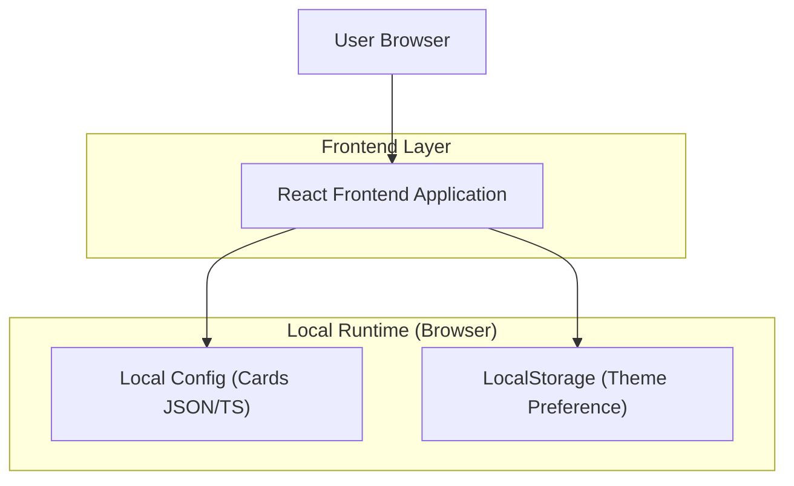

## 1.Architecture design

## 2.Technology Description
- Frontend: React@18 + vite + TypeScript + tailwindcss@3
- Animation: framer-motion
- Backend: None（纯静态站点，适配 GitHub Pages）

## 3.Route definitions
| Route | Purpose |
|-------|---------|
| / | 门户导航首页：主题切换、Hero 动效、卡片网格导航 |
| /404 | GitHub Pages 场景下的兜底 404（可选，避免误链） |

## 6.Data model(if applicable)
（本 MVP 不引入数据库；卡片内容使用前端本地配置文件维护，主题偏好使用 LocalStorage 存储。）
